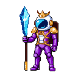
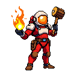

<pre align="center">
 █████  ███    ██  ████████████ ██   ██  ██████  ██████
██   ██ ████   ██ ██            ██   ██ ██    ██ ██   ██
███████ ██ ██  ██ ██  PROJECT   ███████ ██    ██ ██████
██   ██ ██  ██ ██ ██            ██   ██ ██    ██ ██   ██
██   ██ ██   ████  ████████████ ██   ██  ██████  ██   ██

                       by DMUX
</pre>

<p align="center">


</p>

**Persistent memory and Project Brain for Claude Code. Five skills, zero forgetting, fully local.**

> Stop re-explaining your project every session. ProjectAnchor remembers.

---

## Why ProjectAnchor

Coding assistants forget everything between sessions. They re-ask which framework you use. They re-derive yesterday's conventions. They invent answers to questions whose ground truth lives in a file three folders down. They burn tokens re-reading code that has not changed since last time.

ProjectAnchor solves four specific failure modes of long-running assistant work:

| Failure mode | How ProjectAnchor addresses it |
|---|---|
| Memory loss across sessions | SessionStart hook injects PROJECT_DNA and last session summary |
| Context rot mid-session | `/checkpoint` compresses now and re-injects DNA + summary for a fresh restart |
| Hallucinations on project facts | Every recall hit cites a file path; skills refuse fabricated answers |
| Token waste on re-explanation | Compressed summaries replace raw transcripts; DNA pays once per session |

## What's inside

Five skills, two hooks, one CLI. A party of astronaut specialists for a new planet.

<p align="center">

</p>

### anchor-core — *The Keeper*



Mission commander. Orchestrator and fallback. Routes user intent to the right skill.

Commands: `/anchor-status` `/anchor-help`

<br clear="left">

---

### anchor-init — *The Pathfinder*


Scouts a new planet. Guided bootstrap, six questions, one Project DNA.

Commands: `/anchor-init`

<br clear="left">

---

### anchor-dna — *The Archivist*


Mission archivist. Read and edit the six-section Project DNA.

Commands: `/project-status` `/why <topic>` `/add-decision <text>`

<br clear="left">

---

### anchor-compressor — *The Forgemaster*



Onboard engineer. Hammers raw transcripts into tight markdown.

Commands: `/compress` `/summarize-session` `/checkpoint`

<br clear="left">

---

### anchor-recall — *The Seeker*


Field scout. Semantic search with FTS5 fallback. Always cites the source.

Commands: `/recall <query>` `/lessons [topic]`

<br clear="left">

## Install

```bash
npx project-anchor install
```

Bash one-liner alternative:

```bash
curl -fsSL https://raw.githubusercontent.com/iwhceo/project-anchor/main/install.sh | bash
```

Manual install:

```bash
npm install -g project-anchor
project-anchor install
```

Verify:

```bash
project-anchor doctor
```

Requires Node 20 or later. Nothing else (no database server, no Python).

## Quickstart

```bash
# 1. Install
npx project-anchor install

# 2. Open Claude Code in any project
cd ~/my-project
claude

# 3. First time only: bootstrap memory
> /anchor-init
   ... six guided questions ...

# 4. Work normally. At session end, compression runs automatically.

# 5. Next session: DNA + last summary auto-loaded.

# 6. Mid-session, when the conversation gets long:
> /checkpoint

# 7. Ask the past:
> /recall how did we handle JWT expiry
   [0.82] decision  decisions.md#42
     JWT 24h scelto per UX
   [0.71] session   sessions/2026-05-29-1255.md
     Aggiunta endpoint /api/users con auth Bearer
```

## Commands

```
project-anchor install               install hooks and skills
project-anchor uninstall [--keep-data]  remove hooks (surgical, preserves other packs)
project-anchor doctor                run health checks
project-anchor compress -t <jsonl>   compress a transcript to a session summary
project-anchor checkpoint -t <jsonl> mid-session: compress now and print DNA + summary
project-anchor recall <query>        semantic search over memory
project-anchor status                print project status JSON
project-anchor reindex               rebuild embeddings from sessions/*.md
project-anchor --version
```

## How it works

```
SessionStart hook -> read PROJECT_DNA + last sessions/*.md -> inject into context
       |
       v
[Claude Code session runs]
       |
       v
Stop hook -> `project-anchor compress` in background ->
   parse JSONL transcript -> extract files / decisions / blockers / next step ->
   write sessions/<ts>.md -> embed body -> insert into index.sqlite
```

### Token economics

- Raw session transcript: typically **5,000 to 50,000 tokens**.
- Compressed session summary: **500 tokens target, 800 hard cap**.
- SessionStart inject ceiling: **2,000 tokens total** (DNA + last summary).
- `/recall` response: **top-K snippets, each truncated at 200 characters**.

A typical project pays for context recovery once per session (the inject), not once per question.

## PROJECT_DNA

Fixed six-section file at `~/.claude/anchor/<hash>/PROJECT_DNA.md`:

```markdown
# PROJECT_DNA

## Purpose
What this project is, who it serves, what success looks like.

## Stack
TypeScript, Node 20, PostgreSQL, Stripe.

## Conventions
Strict mode TS, one responsibility per file, vitest for tests.

## Decisions
- JWT 24h (UX over strict security)
- httpOnly cookie for refresh token

## People
Owner: DMUX. Reviewer: TBD. Stakeholders: ART Group.

## Glossary
- Anchor: a per-project memory directory
- DNA: the six-section invariant file
```

These six sections answer the questions a new collaborator would have to ask, and none of them are derivable from reading the code alone.

## Storage layout

```
~/.claude/anchor/
├── config.json                 global config
├── models/                     ONNX model cache (~25 MB)
└── <project-hash>/             SHA1(cwd) first 8 chars
    ├── PROJECT_DNA.md
    ├── sessions/
    │   └── 2026-05-29-2055.md
    ├── lessons.md
    ├── decisions.md
    └── index.sqlite
```

State lives in your home directory. **Nothing is ever written into your project's repo.**

## Configuration

`~/.claude/anchor/config.json` (auto-created on first install if missing):

```json
{
  "inject_max_tokens": 2000,
  "compress_target_tokens": 500,
  "compress_hard_cap_tokens": 800,
  "recall_min_score": 0.55,
  "recall_top_k": 5,
  "model": "Xenova/all-MiniLM-L6-v2",
  "background_compress": true,
  "checkpoint_after_messages": 50
}
```

All fields have sane defaults. Override what you need.

## Privacy

- **All processing is local.** No telemetry. No remote sync.
- Embeddings, summaries, and the SQLite index never leave your machine.
- The pack does not read environment variables that contain API keys.
- The only network call at runtime is the one-time embedding model download from Hugging Face on first `recall`.
- `project-anchor doctor` audits the install state in under a second.

## Architecture

See [`docs/PAPER.md`](docs/PAPER.md) for the full design rationale.

## Roadmap

- **v0.1.0** (current): skills, CLI, hooks, embeddings, recall, README, PAPER.
- **v0.2.0**: `doctor` polish, FAQ expansion, contributor guide.
- **v1.0.0**: API freeze, semver guarantees, npm publish.
- **v1.1.0**: optional local web dashboard via `project-anchor dashboard`.
- **v1.2.0**: `sqlite-vec` ANN index for projects above 1000 sessions.
- **v2.0.0**: optional team sync over a user-provided git remote.

## Contributing

See [`CONTRIBUTING.md`](CONTRIBUTING.md). PRs welcome on bugfixes, new skills, language packs, and documentation.

## FAQ

**Does this need a database server?**
No. SQLite is embedded, shipped via `better-sqlite3` as a native npm package. No daemon, no port, no service.

**Does this call any cloud API?**
No, beyond the one-time model download from Hugging Face on first `recall`.

**What if I have other Claude Code hooks installed?**
ProjectAnchor merges into `~/.claude/settings.json` non-destructively, marked with `_anchor: true`. Uninstall removes only those entries.

**How big is the storage footprint?**
Per project: about 30 KB plus 1.5 KB per compressed session. Across all projects, the ONNX model cache is the largest item at around 25 MB.

**Will compression break if my transcript is huge?**
For transcripts above 50k tokens, the pipeline chunks by topic boundary and produces a summary-of-summaries.

**Can I share PROJECT_DNA with my team?**
Not in v1.0. Team sync is on the v2.0 roadmap. For now, copy the file by hand if you want.

**What if the embedding download fails offline?**
`/recall` falls back to FTS5 keyword search until the model is available.

**Why six DNA sections, not five or seven?**
Purpose, Stack, Conventions, Decisions, People, Glossary cover the questions a new collaborator must ask that code alone cannot answer. Fewer leaves gaps; more invites filler.

## About the author

**DMUX** is CEO and co-founder of the **ART Group**, which since 2012 has developed its own proprietary large language model, **YurekAI**, used internally for more than a decade to build the advanced technological solutions of the group.

ProjectAnchor is a **personal contribution** from DMUX to the developer community that uses Claude Code. It is intentionally local-first, free, MIT licensed, and aligned with the principle that durable engineering memory belongs to the engineer, not to a vendor cloud.

And who knows: in the near future the ART Group may decide to open access to **YurekAI** to anyone interested. Stay tuned through this repository, where updates on this front will also be published.

The Italian version of this section lives in [`docs/AUTHOR.it.md`](docs/AUTHOR.it.md).

## License

MIT © DMUX. See [`LICENSE`](LICENSE).

## Star history

[View star history on star-history.com](https://star-history.com/#iwhceo/project-anchor&Date) (chart appears once the repo has its first stars).
